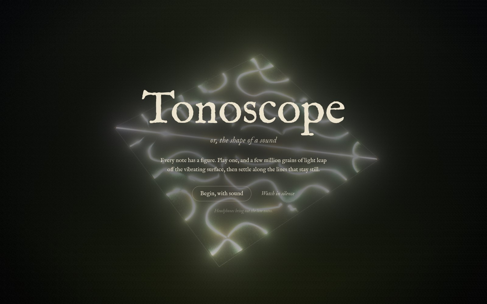
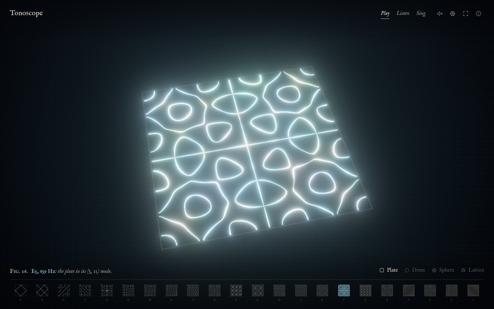
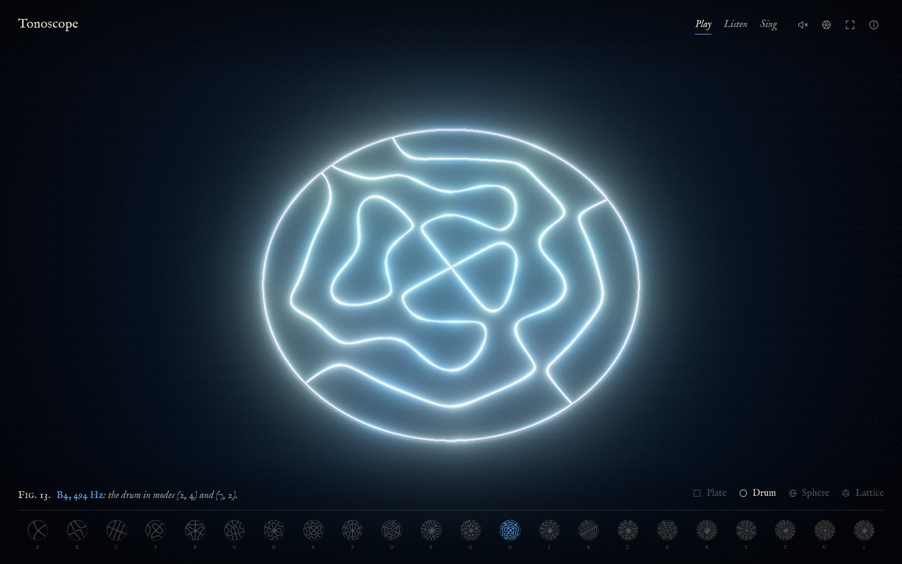
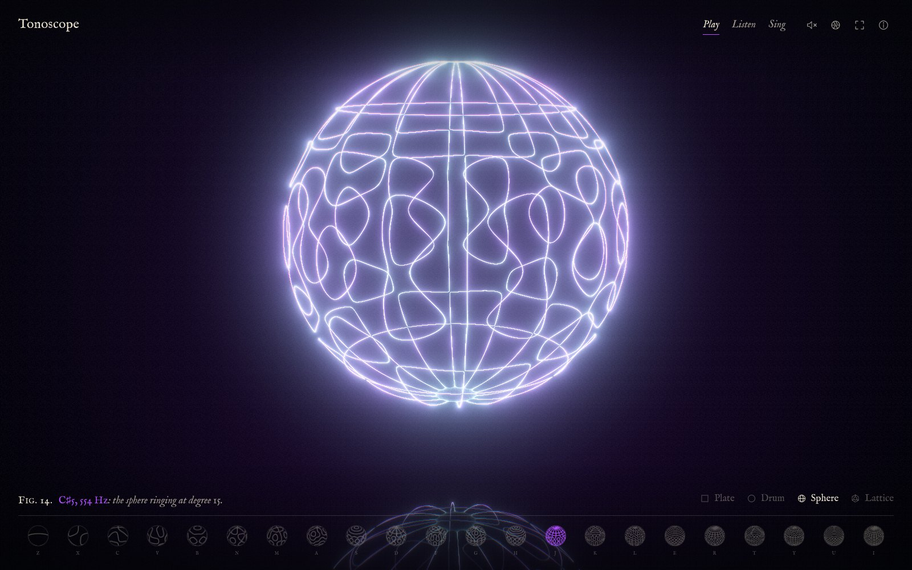
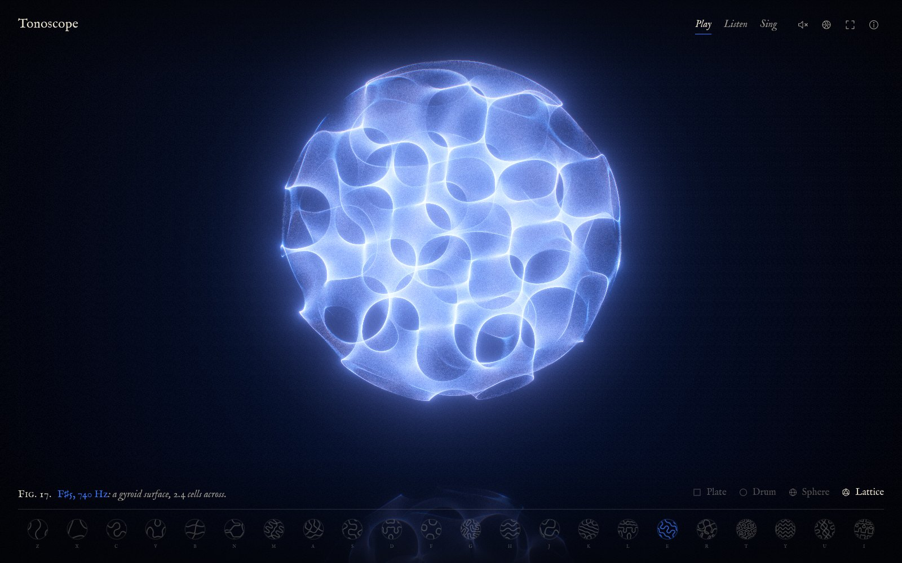

<div align="center">
  <h1>tonoscope</h1>
  <p><b>Play or sing a note and millions of WebGPU grains settle into its standing-wave figure, like sand on a Chladni plate.</b>
  <div>4 resonators • 22 notes • 4 million grains</div>
  </p>
</div>

<div align="center">

[](./CHANGELOG.md) [](https://www.typescriptlang.org/) [](https://www.w3.org/TR/webgpu/) [](https://bun.sh/)

</div>

> [!NOTE]
> **Developer note:** Tonoscope is an experiment in Claude Opus 5.5's one-shot ability. From one open-ended prompt asking for the most "magical", futuristic-feeling visual a browser can show, Claude designed and built the whole instrument (physics, WGSL shaders, synthesized audio, interface, tests and docs) in about an hour, with no human edits or feedback. That build is tagged [`v0.1.0`](https://github.com/cyanheads/tonoscope/tree/v0.1.0). The [`v0.1.1`](https://github.com/cyanheads/tonoscope/releases/tag/v0.1.1) release marks the one-shot snapshot, adding a fix from the same session, hosting config, a link to the source and the license.

---



A vibrating surface never moves all at once. It splits into regions swinging in opposite directions, separated by lines that stay still, and sand thrown off the moving regions comes to rest on those lines. Tonoscope does this with light. Each note excites one standing-wave mode of the chosen resonator, and a few million simulated grains leap, drift and settle into its figure while a synthesized glass voice rings. Higher notes ring in finer modes, so their figures grow more intricate.

## Resonators

| Resonator | What vibrates | Figures |
|:---|:---|:---|
| **Plate** | A square plate with free edges | Chladni's own figures: crosses, loops and lattices |
| **Drum** | A round membrane clamped at the rim, in Bessel modes | Mandalas of diameters and rings |
| **Sphere** | A ringing shell, in spherical harmonics | Planets seamed with nodal lines |
| **Lattice** | Standing waves filling a ball | Gyroids, Schwarz and I-WP surfaces, drawn as glowing membranes |

| | |
|:---:|:---:|
|  |  |
|  |  |

## Ways to play

| Way | What happens |
|:---|:---|
| **Play** | Click, tap or type; the note under the pointer sounds and its figure forms |
| **Listen** | A generative piece in D Lydian plays itself, one bowed chord root per bar with struck notes above |
| **Sing** | Sing or hum into the microphone; your pitch picks the figure and its color, as with Hans Jenny's tonoscope |

| Input | Action |
|:---|:---|
| Click or tap | Plays the column under the pointer, low notes left, high right. Hold to sustain; drag for a run |
| Z–M, A–J, Q–U | Three octaves of D Lydian, one letter row per octave |
| Pointer movement | Stirs the grains like a fingertip through sand |
| Right-drag, Shift-drag, two fingers | Turns the view |
| Scroll, pinch | Moves closer or farther |
| 1–4 | Switches resonator |
| Space | Toggles Listen |

## Features

- Every grain is simulated on the GPU each frame: hops off vibrating regions, slides toward nodal lines, and leaps on note onsets so each new figure forms from fresh sand.
- Mode math is real: plate cosine modes, drum modes at computed Bessel zeros, fully normalized spherical harmonics, and triply periodic minimal-surface functions.
- Each pitch carries the color Scriabin gave it for *Prometheus*; grains take on the color of whichever note last moved them.
- Glass-harmonica voices, a generated hall reverb, a ping-pong delay and a low drone, all synthesized with the Web Audio API. No audio files ship.
- Changing resonator sends every grain flying to the new vessel along a divergence-free swirl.
- The strip of figures along the bottom is drawn from the same mode math, one engraving per note.
- Sheds grains automatically on devices that cannot hold a smooth frame rate.

## Getting started

Play it at **https://tonoscope.caseyjhand.com** in a browser with WebGPU: current Chrome, Edge or Safari (macOS and iOS 26+), or Firefox on Windows.

To run it locally:

```sh
git clone https://github.com/cyanheads/tonoscope.git
cd tonoscope
bun install
bun run dev
```

Open http://127.0.0.1:5199/ and choose **Begin, with sound**.

## Configuration

No environment variables. One URL parameter:

| Parameter | Default | What it does |
|:---|:---|:---|
| `grains` | `4m` desktop, `1m` touch devices | Grain count, e.g. `?grains=8m` or `?grains=500k`. Capped by the GPU's storage-buffer limit |

## Running

| Command | What it does |
|:---|:---|
| `bun run dev` | Vite dev server on port 5199 with hot reload |
| `bun run build` | Static production build into `dist/` |
| `bun run preview` | Serves `dist/` on port 5199 |
| `bun run check` | Typecheck, Biome lint, Vitest, changelog sync — the gate |
| `bun run snapshot` | Headless-Chrome stills of each resonator into `stills/` (needs `bun run dev` running) |
| `bun run deploy` | Runs the gate, builds, and uploads `dist/` to Cloudflare Workers at tonoscope.caseyjhand.com (needs `CLOUDFLARE_API_TOKEN` with Workers Scripts edit) |

## Project structure

| Path | Purpose |
|:---|:---|
| `src/main.ts` | Composition root and frame loop |
| `src/gpu/` | WebGPU device, grain simulation, renderer, WGSL shaders |
| `src/resonance/` | Resonators, their modes, Bessel/Legendre tables, slot packing |
| `src/audio/` | Synth engine, glass voices, microphone, pitch detection |
| `src/music/` | Scale, Scriabin colors, Listen-mode composer |
| `src/instrument/` | Note lifecycle, pointer and keyboard input, key layout |
| `src/view/` | Orbit camera and matrix math |
| `src/ui/` | Page chrome: title page, captions, figure strip, about panel, styles |
| `public/_headers` | Security and cache headers served with every file (CSP, permissions, HSTS) |
| `wrangler.jsonc` | Cloudflare Workers static-assets config and the custom domain |
| `tests/` | Vitest suites mirroring `src/` |
| `scripts/` | Changelog builder, snapshot tool |
| `docs/design.md` | How a note becomes a figure, and the decisions behind it |

## Development guide

- The mode functions exist twice, in `src/resonance/vessels.ts` (CPU) and `src/gpu/shaders/simulate.wgsl` (GPU). Change both together.
- Uniform layouts are hand-packed in `src/gpu/particle-system.ts` and `src/gpu/renderer.ts`; keep them in step with the WGSL structs.
- See `CLAUDE.md` for the working rules and `docs/design.md` for the physics.

## Contributing

`bun run check` must pass. Visual changes get a `bun run snapshot` review before they land.

## License

[Apache-2.0](./LICENSE). The IM Fell English font the site ships, from `@fontsource/im-fell-english`, is under the SIL Open Font License 1.1.
